# 🔐 Flujo de Autenticación Completo — Raíces para Florecer

**Última actualización:** 11 de agosto, 2026  
**Backend:** NestJS + Firebase Auth + Firestore

---

## 📋 Índice

1. [Resumen del Sistema](#-resumen-del-sistema)
2. [Flujo de Sesión Segura (Cookies httpOnly)](#-flujo-de-sesión-segura-cookies-httponly)
3. [Flujo de Registro](#-flujo-de-registro)
4. [Flujo de Login](#-flujo-de-login)
5. [Flujo de Refresh Token](#-flujo-de-refresh-token)
6. [Flujo de Verificación de Token](#-flujo-de-verificación-de-token)
7. [Flujo de Control de Acceso](#-flujo-de-control-de-acceso)
8. [Flujo Completo End-to-End](#-flujo-completo-end-to-end)
9. [Diagrama de Estados del Token](#-diagrama-de-estados-del-token)
10. [Flujo de Excepciones](#-flujo-de-excepciones)
11. [Referencia de Código](#-referencia-de-código)

---

## 🏗️ Resumen del Sistema

### Arquitectura de Autenticación

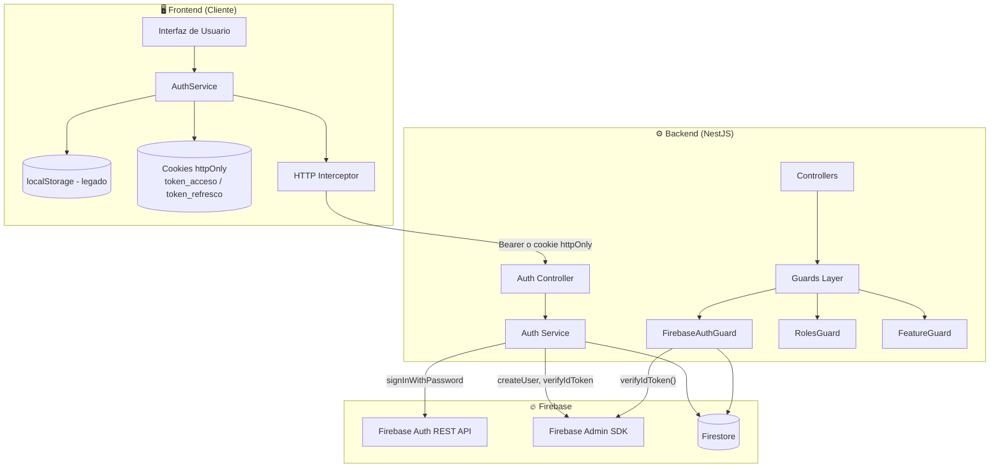

### Componentes Clave

| Componente | Archivo | Responsabilidad |
|------------|---------|-----------------|
| **AuthService** | `src/modules/auth/auth.service.ts` | Lógica de negocio: registro, login, refresh |
| **AuthController** | `src/modules/auth/auth.controller.ts` | Emite cookies httpOnly (login/refresh) y `cerrar-sesion` |
| **FirebaseAuthGuard** | `src/common/guards/firebase-auth.guard.ts` | Verificar token (Bearer o cookie) y poblar `request.user` |
| **RolesGuard** | `src/common/guards/roles.guard.ts` | Verificar rol del usuario |
| **FeatureGuard** | `src/common/guards/feature.guard.ts` | Verificar features habilitadas |
| **Firebase Auth REST API** | Externo | Autenticar credenciales, generar tokens |
| **Firebase Admin SDK** | Externo | Verificar tokens, gestionar usuarios |

---

## 🔒 Flujo de Sesión Segura (Cookies httpOnly)

> **Actualización (11 de agosto, 2026):** el backend ahora entrega los tokens
> de sesión **además** como cookies `httpOnly`, invisibles para JavaScript.
> Esto elimina el vector de robo de tokens por XSS que implica guardarlos en
> `localStorage`. El header `Authorization: Bearer` **sigue funcionando**
> (migración transparente): el guard acepta ambos mecanismos.

### Mecanismo Dual

| Mecanismo | Cómo llega al backend | Estado |
|-----------|----------------------|--------|
| **Cookie httpOnly** (recomendado) | El navegador la envía sola en cada request (no requiere JS) | 🆕 Nuevo |
| **Header `Authorization: Bearer <token>`** | El frontend lo agrega manualmente | Mantenido (compatibilidad) |

### Cookies de Sesión

| Cookie | Contenido | Duración | Flags |
|--------|-----------|----------|-------|
| `token_acceso` | ID token de Firebase (JWT) | 1 hora (`Max-Age=3600`) | `HttpOnly`, `Secure`, `SameSite`, `Path=/` |
| `token_refresco` | Refresh token de Firebase | 30 días (`Max-Age=2592000`) | `HttpOnly`, `Secure`, `SameSite`, `Path=/` |

- **`HttpOnly`**: `document.cookie` no puede leerla → un XSS no puede robar el token.
- **`Secure`**: solo viaja por HTTPS. Se activa por defecto cuando `NODE_ENV=production` (el deploy de Cloud Run lo fija); se puede forzar con `COOKIE_SECURE=true|false`.
- **`SameSite`**: configurable con `COOKIE_SAMESITE` (`lax` por defecto → mitiga CSRF). Si frontend y API están en orígenes distintos (cross-site), usar `none` + `Secure`.

### Endpoints de Sesión

- `POST /autenticacion/inicio-sesion` → `200` + `Set-Cookie` (`token_acceso`, `token_refresco`) + tokens en el body (compatibilidad).
- `POST /autenticacion/renovar-token` → acepta `tokenRefresco` en el body **o** en la cookie `token_refresco`; renueva ambas cookies.
- `POST /autenticacion/cerrar-sesion` → `204`, elimina ambas cookies. **Obligatorio** para desloguear: JavaScript no puede borrar cookies `httpOnly`.
- `GET /autenticacion/yo` → perfil del usuario autenticado (rehidratación tras un refresh de página).

### Protección CSRF

- Con `SameSite=Lax` (default) el navegador no envía la cookie en POST cross-site → CSRF mitigada por el navegador.
- Defensa en profundidad en el backend: si la autenticación vino de la cookie y el método puede modificar estado (POST/PUT/DELETE), el `FirebaseAuthGuard` valida el header `Origin` contra la lista de orígenes permitidos (`CORS_ORIGINS` + orígenes base). Respuesta `403` si el origen no está permitido.
- `POST /autenticacion/cerrar-sesion` aplica la misma validación de `Origin` (anti logout-CSRF).

### ¿Qué pasa con localStorage?

Los tokens siguen llegando en el body de la respuesta para no romper clientes existentes, pero **ya no son la vía recomendada**: si el frontend guarda `tokenAcceso`/`tokenRefresco` en `localStorage`, cualquier XSS los roba. El flujo seguro es:

1. Login → el navegador recibe las cookies `httpOnly` automáticamente.
2. En cada request, el navegador envía la cookie sola (con `credentials: 'include'` / `withCredentials: true`).
3. Tras recargar la página, rehidratar con `GET /autenticacion/yo` (el JS no puede leer la cookie).
4. Logout → `POST /autenticacion/cerrar-sesion`.

---

## 📝 Flujo de Registro

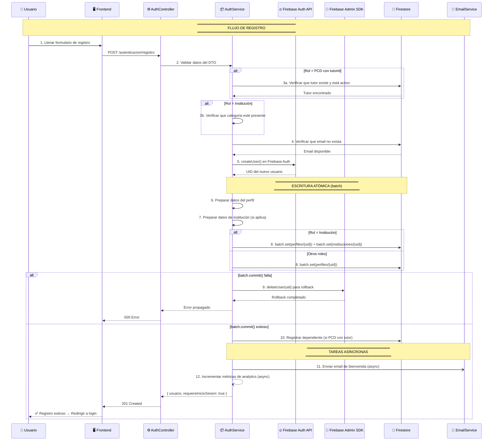

### Puntos Clave del Registro

```
┌─────────────────────────────────────────────────────────────────┐
│                     PUNTOS CLAVE                                │
├─────────────────────────────────────────────────────────────────┤
│                                                                 │
│  1. ❌ NO retorna tokens → obliga a hacer login después         │
│     Razón: Un custom token de Firebase ≠ ID token               │
│     verifyIdToken() rechaza custom tokens                       │
│                                                                 │
│  2. ✅ Escritura atómica con batch()                            │
│     Si falla → rollback (elimina usuario de Firebase Auth)      │
│                                                                 │
│  3. ✅ Validación de duplicados ANTES de crear usuario           │
│     Busca en Firestore antes de llamar a createUser()           │
│                                                                 │
│  4. ✅ Email de bienvenida se envía de forma asíncrona           │
│     No bloquea la respuesta al usuario                          │
│                                                                 │
│  5. ✅ Métricas se incrementan de forma asíncrona                │
│     No afecta la performance del registro                       │
│                                                                 │
└─────────────────────────────────────────────────────────────────┘
```

---

## 🔑 Flujo de Login

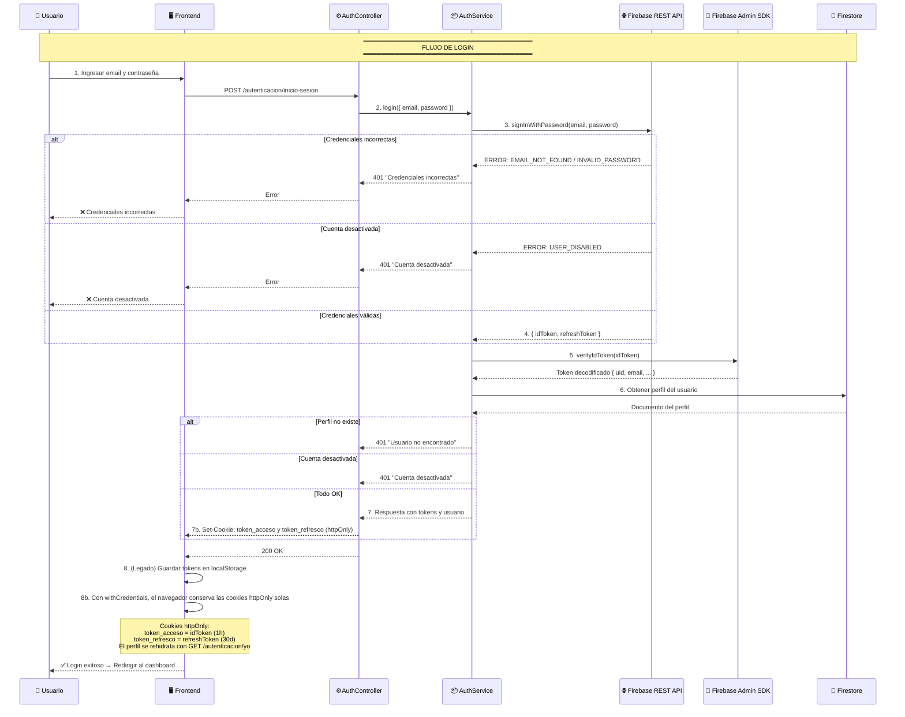

### Respuesta del Login

```json
{
  "tokenAcceso": "eyJhbGciOiJSUzI1NiIsInR5cCI6IkpXVCJ9...",
  "tokenRefresco": "AMf9BxSj...",
  "expiraEn": 3600,
  "usuario": {
    "id": "abc123",
    "email": "usuario@ejemplo.com",
    "rol": "pcd",
    "nombreCompleto": "Juan Pérez",
    "tutorId": null,
    "institucionId": null,
    "features": {
      "chat": true,
      "postulaciones": true,
      "comunidad": true,
      "resenas": true,
      "descubrimiento": true,
      "favoritos": true,
      "multimedia": true
    }
  }
}
```

### Cookies httpOnly de la Respuesta

Además del body, `login()` y `renovar-token()` envían los headers `Set-Cookie`:

```
Set-Cookie: token_acceso=<idToken>; Path=/; HttpOnly; Secure; SameSite=Lax; Max-Age=3600
Set-Cookie: token_refresco=<refreshToken>; Path=/; HttpOnly; Secure; SameSite=Lax; Max-Age=2592000
```

> Los flags `Secure` y `SameSite` dependen de `COOKIE_SECURE` y `COOKIE_SAMESITE`
> (ver [Flujo de Sesión Segura](#-flujo-de-sesión-segura-cookies-httponly)).

### Flujo de Almacenamiento en Frontend

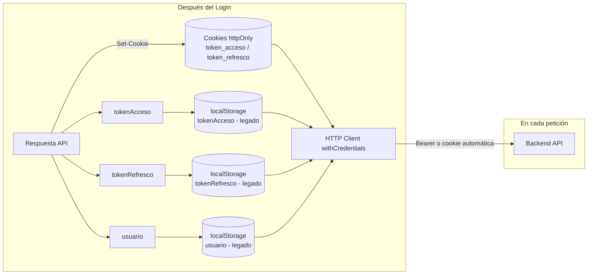

---

## 🔄 Flujo de Refresh Token

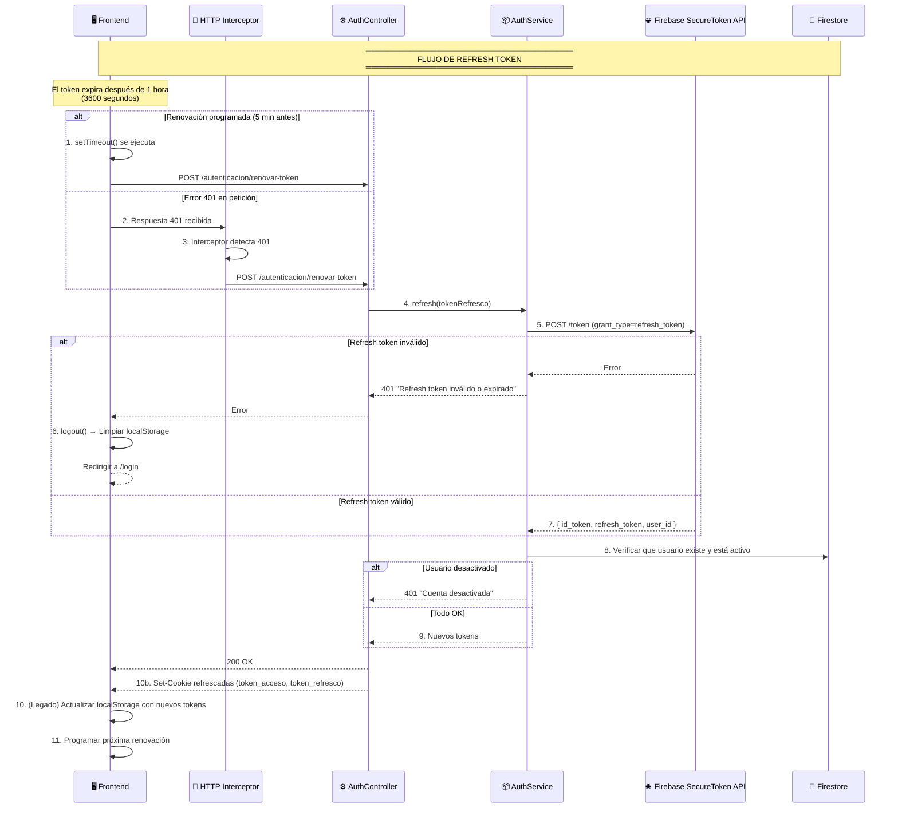

> **Nota (flujo cookies):** `renovar-token` acepta `tokenRefresco` en el body
> **o** en la cookie httpOnly `token_refresco`. Con cookies, el interceptor
> renueva sin leer ningún token desde JavaScript.

### Estrategia de Renovación en Frontend

```typescript
// 🔄 Renovación programada (recomendada)
// Se ejecuta 5 minutos ANTES de que el token expire

programarRenovacion(expiraEn: number): void {
  // Renovar 5 minutos antes de expirar
  const tiempoRenovacion = (expiraEn - 300) * 1000; // milisegundos
  
  setTimeout(() => {
    this.renovarToken();
  }, tiempoRenovacion);
}

// 🔄 Renovación reactiva (fallback)
// Se ejecuta cuando se recibe un error 401

intercept(request, next) {
  return next.handle(request).pipe(
    catchError(error => {
      if (error.status === 401 && !request.url.includes('login')) {
        return this.renovarYReintentar(request, next);
      }
      return throwError(error);
    })
  );
}
```

---

## 🛡️ Flujo de Verificación de Token

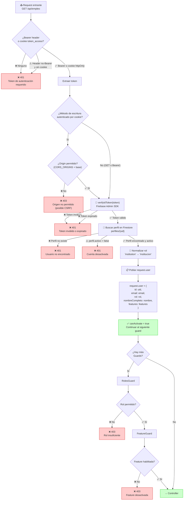

### Datos del Token Firebase (JWT)

```json
{
  "iss": "https://securetoken.google.com/raices-499122",
  "sub": "abc123",
  "aud": "raices-499122",
  "exp": 1786516800,
  "iat": 1786513200,
  "auth_time": 1786513200,
  "uid": "abc123",
  "email": "usuario@ejemplo.com",
  "email_verified": false
}
```

---

## 🎭 Flujo de Control de Acceso

### RolesGuard

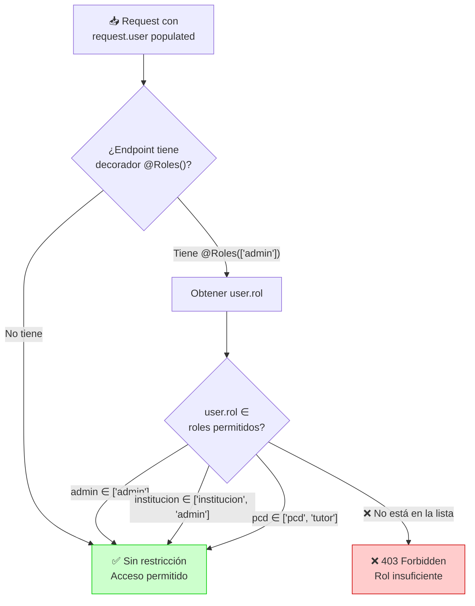

### Ejemplo de Uso

```typescript
// ✅ Solo administradores
@UseGuards(JwtAuthGuard, RolesGuard)
@Roles('admin')
@Get('estadisticas')
obtenerEstadisticas() { ... }

// ✅ Instituciones y administradores
@UseGuards(JwtAuthGuard, RolesGuard)
@Roles('institucion', 'admin')
@Post()
crearVacante() { ... }

// ✅ Usuarios PCD y tutores
@UseGuards(JwtAuthGuard, RolesGuard)
@Roles('pcd', 'tutor')
@Post(':id/postularse')
postularse() { ... }
```

### FeatureGuard

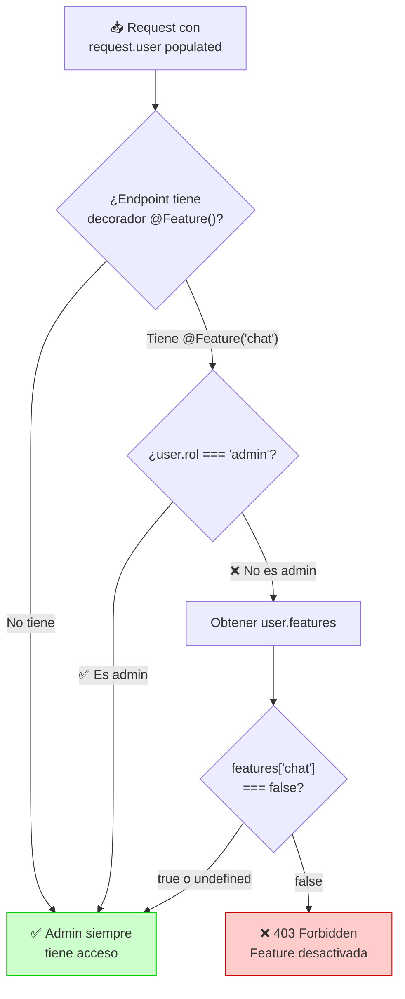

### Ejemplo de Uso

```typescript
// ✅ Requiere feature 'chat' habilitada
@UseGuards(JwtAuthGuard, FeatureGuard)
@Feature('chat')
@Post('enviar/:userId')
enviarMensaje() { ... }

// ✅ Requiere feature 'postulaciones' habilitada
@UseGuards(JwtAuthGuard, RolesGuard, FeatureGuard)
@Roles('institucion', 'admin')
@Feature('postulaciones')
@Get('postulantes-vacante')
obtenerPostulantes() { ... }
```

---

## 🔗 Flujo Completo End-to-End

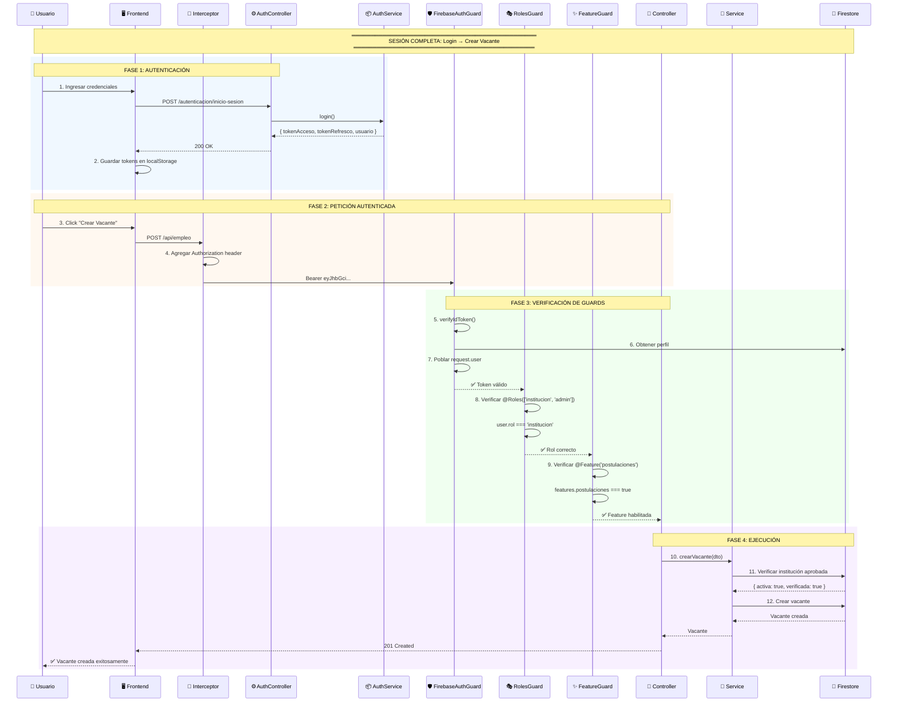

---

## 📊 Diagrama de Estados del Token

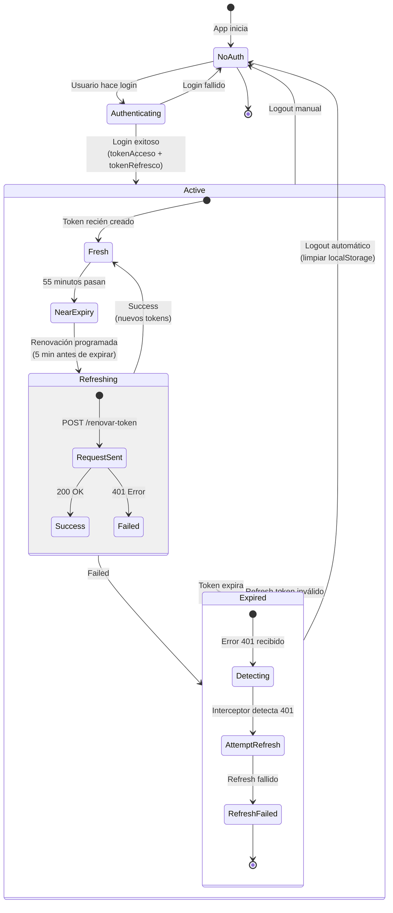

### Tiempos de Expiración

```
┌─────────────────────────────────────────────────────────────────┐
│                    TIEMPOS DE TOKEN                              │
├─────────────────────────────────────────────────────────────────┤
│                                                                 │
│  tokenAcceso (ID Token):                                        │
│  ├── Expira en: 1 hora (3600 segundos)                          │
│  ├── Renovar: 5 minutos antes de expirar                        │
│  ├── Uso: Authorization: Bearer <token>                         │
│  └── Cookie httpOnly token_acceso (Max-Age=3600s)               │
│                                                                 │
│  tokenRefresco:                                                 │
│  ├── Expira en: ~30 días (varía según Firebase)                 │
│  ├── Se renueva automáticamente al usarlo                       │
│  ├── Uso: POST /autenticacion/renovar-token                     │
│  └── Cookie httpOnly token_refresco (Max-Age=30 días)           │
│                                                                 │
│  Frontend Strategy:                                             │
│  ├── Primary: Renovación programada (setTimeout)                │
│  ├── Fallback: Renovación reactiva (intercept 401)              │
│  └── Logout: POST /autenticacion/cerrar-sesion                  │
│                                                                 │
└─────────────────────────────────────────────────────────────────┘
```

---

## ⚠️ Flujo de Excepciones

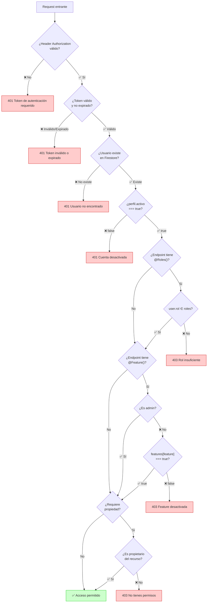

### Tabla de Errores Comunes

| Código | Mensaje | Causa | Solución |
|--------|---------|-------|----------|
| `401` | Token de autenticación requerido | No se envió header | Agregar `Authorization: Bearer <token>` |
| `401` | Token inválido o expirado | Token expirado o corrupto | Renovar token con refresh |
| `401` | Usuario no encontrado | Perfil borrado de Firestore | Re-login necesario |
| `401` | Cuenta desactivada | Admin desactivó la cuenta | Contactar soporte |
| `403` | Rol insuficiente | Usuario no tiene el rol requerido | Verificar roles del usuario |
| `403` | Feature desactivada | Feature no habilitada para el usuario | Contactar tutor/admin |
| `400` | Token de refresco requerido | Falta `tokenRefresco` en body y en la cookie `token_refresco` | Enviar body o cookie |
| `403` | Origen no permitido (posible CSRF) | Origin no permitido en request autenticado por cookie | Verificar `CORS_ORIGINS` / orígenes base |

---

## 📚 Referencia de Código

### FirebaseAuthGuard — Verificación de Token

```typescript
// src/common/guards/firebase-auth.guard.ts (resumen)
// 1. Fuente del token: header Bearer (compatibilidad) o cookie httpOnly token_acceso.
let token: string | undefined
if (authHeader?.startsWith('Bearer ')) {
  token = authHeader.split(' ')[1]
} else {
  token = parseCookies(request.headers?.cookie)[NOMBRE_COOKIE_ACCESO]
}
if (!token) throw new UnauthorizedException('Token de autenticación requerido')

// 2. Defensa CSRF: método de escritura autenticado por cookie exige Origin permitido.
if (!esBearer && !['GET', 'HEAD', 'OPTIONS'].includes(request.method)) {
  const origin = request.headers['origin']
  if (!esOrigenPermitido(origin, obtenerOrigenesPermitidos(config))) {
    throw new ForbiddenException('Origen no permitido (posible CSRF)')
  }
}

// 3. Verificar con Firebase Admin SDK y poblar request.user (igual que antes)
const decodedToken = await getAuth().verifyIdToken(token)
```

### RolesGuard — Verificación de Rol

```typescript
// src/common/guards/roles.guard.ts
canActivate(ctx: ExecutionContext): boolean {
  // Obtener roles requeridos del decorador @Roles()
  const roles = this.reflector.getAllAndOverride<string[]>(
    'roles', 
    [ctx.getHandler(), ctx.getClass()]
  )
  
  // Si no hay restricción, permitir acceso
  if (!roles || roles.length === 0) return true

  const { user } = ctx.switchToHttp().getRequest()
  
  // Verificar que el usuario tiene uno de los roles permitidos
  if (!user || !roles.includes(user.rol)) {
    throw new ForbiddenException('Rol insuficiente')
  }

  return true
}
```

### FeatureGuard — Verificación de Feature

```typescript
// src/common/guards/feature.guard.ts
canActivate(ctx: ExecutionContext): boolean {
  // Obtener feature requerida del decorador @Feature()
  const feature = this.reflector.getAllAndOverride<string>(
    'feature', 
    [ctx.getHandler(), ctx.getClass()]
  )
  
  // Si no hay restricción, permitir acceso
  if (!feature) return true

  const request = ctx.switchToHttp().getRequest()
  const user = request.user

  // Admin siempre tiene acceso
  if (user?.rol === 'admin') return true

  const features = user?.features ?? FEATURES_POR_DEFECTO

  // Verificar que la feature está habilitada
  if (features[feature] === false) {
    throw new ForbiddenException(
      `Funcionalidad "${feature}" desactivada para tu cuenta.`
    )
  }

  return true
}
```

---

## 🎯 Resumen Visual

```mermaid
graph LR
    subgraph "Paso 1: Login"
        A[Email + Password] -->|POST /login| B[tokenAcceso<br/>tokenRefresco]
    end

    subgraph "Paso 2: Guardar"
        B -->|Set-Cookie httpOnly| C[(Cookies<br/>token_acceso / token_refresco)]
        B -->|localStorage (legado)| J[(localStorage)]
    end

    subgraph "Paso 3: Request"
        C -->|Cookie automática<br/>o Bearer header| D[API Request]
    end

    subgraph "Paso 4: Verificar"
        D -->|FirebaseAuthGuard| E[request.user]
        E -->|RolesGuard| F{Rol OK?}
        E -->|FeatureGuard| G{Feature OK?}
    end

    subgraph "Paso 5: Ejecutar"
        F -->|✅| H[Controller]
        G -->|✅| H
    end

    subgraph "Paso 6: Renovar"
        C -->|5 min antes expiración| I[Refresh Token]
        I -->|Nuevos tokens| B
    end

    subgraph "Paso 7: Cerrar sesión"
        B -->|POST /cerrar-sesion| K[Elimina cookies httpOnly]
    end

    style A fill:#e1f5fe
    style B fill:#c8e6c9
    style C fill:#fff9c4
    style H fill:#c8e6c9
```

---

**¿Necesitas más detalles sobre algún flujo específico?** Consulta la [GUÍA DE INTEGRACIÓN FRONTEND](./FRONTEND-INTEGRATION-GUIDE.md) para ejemplos de código completos.
