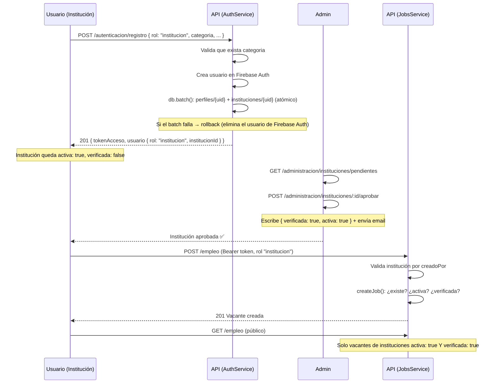

# 🏢 Flujo de Aprobación de Instituciones y Publicación de Vacantes

> **Para:** Isa (Backend Developer)
> **Autor:** Equipo Raíces
> **Fecha:** Agosto 2026
> **Objetivo:** Documentar el flujo completo del módulo de Empleo: registro como institución → aprobación por un administrador → publicación de vacantes, y las reglas de negocio aplicadas en el backend.

---

## 📋 Índice

1. [Resumen Ejecutivo](#1-resumen-ejecutivo)
2. [Modelo de Datos en Firestore](#2-modelo-de-datos-en-firestore)
3. [Flujo Paso a Paso](#3-flujo-paso-a-paso)
4. [Reglas de Negocio y Validaciones](#4-reglas-de-negocio-y-validaciones)
5. [Endpoints Involucrados](#5-endpoints-involucrados)
6. [Estados Posibles de una Institución](#6-estados-posibles-de-una-institución)
7. [Casos de Error](#7-casos-de-error)
8. [Pruebas](#8-pruebas)
9. [Preguntas Frecuentes](#9-preguntas-frecuentes)

---

## 1. Resumen Ejecutivo

**¿Qué hace este flujo?** Una persona registra su organización como **institución**, un **administrador la aprueba** y solo entonces la institución puede **publicar vacantes** de empleo inclusivo en el directorio público.

**Reglas clave:**
- El rol canónico es **`institucion`** (el guard normaliza el legacy `institution` automáticamente).
- El registro crea de forma **atómica** (un solo `db.batch()`) los documentos `perfiles/{uid}` e `instituciones/{uid}`, con vínculo explícito (`institucionId`, `creadoPor`, `usuarioId`).
- Una institución recién registrada nace con **`activa: true`** y **`verificada: false`** (pendiente de aprobación).
- **Solo instituciones `activa: true` Y `verificada: true`** pueden:
  - Publicar vacantes (`POST /api/empleo`).
  - Aparecer en el listado público de vacantes (`GET /api/empleo`) y en el directorio (`GET /api/instituciones`).

---

## 2. Modelo de Datos en Firestore

### 📁 Colecciones involucradas

```
perfiles/{uid}                    ← Perfil del usuario
├── rol: "institucion"
├── institucionId: <uid>          ← Vínculo con su institución
├── activo: boolean
└── verificado: boolean

instituciones/{uid}               ← Documento de la institución (id = UID)
├── nombre, emailContacto
├── categoria: "funcional" | "educativo" | "laboral" | "social"
├── descripcion, telefono
├── tiposDiscapacidad: string[]
├── creadoPor: <uid>              ← Dueño (permite findMine y propiedad)
├── usuarioId: <uid>              ← Alias del dueño
├── activa: boolean
├── verificada: boolean           ← Aprobación del admin
├── calificacionPromedio, cantidadCalificaciones
└── fechaCreacion

vacantes/{id}                     ← Vacantes de empleo
├── institucionId: <institucionId>
├── titulo, descripcion, requisitos, modalidad, ...
└── activa: boolean
```

> **Nota:** las instituciones creadas vía `POST /api/instituciones` (endpoint de creación manual) usan un ID aleatorio y se localizan por `creadoPor`. Las creadas en el **registro** usan `id = UID` (documento canónico).

---

## 3. Flujo Paso a Paso



### Registro como institución (detalle)

1. **Validaciones previas** en `auth.service.ts` (`register`):
   - Si viene `tutorId`, solo aplica a rol `pcd` (no a instituciones).
   - Si `rol === 'institucion'` y falta `categoria` → `400 Bad Request: La categoría es obligatoria para registrar una institución`.
   - Email duplicado → `409 Conflict`.
2. **Creación del usuario** en Firebase Auth.
3. **Escritura atómica** con `db.batch()`:
   - `perfiles/{uid}` con `institucionId: uid`.
   - `instituciones/{uid}` con `creadoPor`, `usuarioId`, `categoria`, `descripcion`, `telefono`, `tiposDiscapacidad`, `activa: true`, `verificada: false`.
   - Si el `batch.commit()` falla → se elimina el usuario de Firebase Auth (rollback) y se propaga el error.

---

## 4. Reglas de Negocio y Validaciones

### Publicación de vacantes — `jobs.service.ts` (`createJob`)

| Condición | Resultado |
|-----------|-----------|
| La institución **no existe** | `404 Not Found` → *"Institución no encontrada"* |
| `activa !== true` | `403 Forbidden` → *"La institución se encuentra inactiva"* |
| `verificada !== true` | `403 Forbidden` → *"La institución debe estar aprobada por un administrador para publicar vacantes"* |
| Todo correcto | Crea la vacante y devuelve el detalle |

**Roles permitidos para crear vacantes** (`@Roles('institucion', 'admin')`):
- Usuario con rol `institucion`: se resuelve su institución por `creadoPor`.
- Admin: debe enviar `institucionId` explícito.
- Cualquier otro rol → `403` del `RolesGuard`.

### Listado público — `jobs.service.ts` (`findAll`)

- Se retornan **únicamente** vacantes cuya institución tenga `activa === true` **y** `verificada === true`.
- Vacantes de instituciones inactivas o no aprobadas quedan ocultas del público.

### Aprobación — `admin.service.ts` (`approveInstitution`)

- Escribe **`{ verificada: true, activa: true }`** en `instituciones/{id}`.
- Envía correo de notificación (`sendInstitutionApproved`).
- Con esto la institución queda visible en el directorio y **desbloqueada para publicar vacantes**.

---

## 5. Endpoints Involucrados

### Público / Institución

| Método | Ruta | Rol | Descripción |
|--------|------|-----|-------------|
| `POST` | `/api/autenticacion/registro` | Público | Registro (rol `institucion` con `categoria` obligatoria) |
| `GET` | `/api/autenticacion/yo` | Autenticado | Perfil con objeto `institucion` adjunto |
| `GET` | `/api/usuarios/perfil` | Autenticado | Perfil completo con `institucion` adjunta |
| `GET` | `/api/instituciones/mi-institucion` | Autenticado | Institución del usuario (doc canónico o por `creadoPor`) |
| `PUT` | `/api/instituciones/mi-institucion` | Autenticado | Actualizar su institución |
| `GET` | `/api/instituciones` | Público | Directorio (solo `activa && verificada`) |
| `POST` | `/api/empleo` | `institucion`, `admin` | Crear vacante (requiere institución aprobada) |
| `GET` | `/api/empleo` | Público | Listado de vacantes (solo instituciones aprobadas) |
| `PUT`/`DELETE` | `/api/empleo/:id` | `institucion`, `admin` | Editar / desactivar vacante |

### Administración (todos con `@Roles('admin')`)

| Método | Ruta | Descripción |
|--------|------|-------------|
| `GET` | `/api/administracion/instituciones/pendientes` | Instituciones pendientes de aprobación |
| `POST` | `/api/administracion/instituciones/:id/aprobar` | Aprobar (deja `verificada: true` y `activa: true`) |
| `PATCH` | `/api/administracion/instituciones/:id/verificar` | Alternar verificación |
| `DELETE` | `/api/administracion/instituciones/:id` | Rechazar (elimina institución + vacantes y desactiva el perfil vinculado) |

---

## 6. Estados Posibles de una Institución

| Estado | `activa` | `verificada` | En directorio | Publica vacantes | En listado de vacantes |
|--------|:-------:|:------------:|:-------------:|:----------------:|:----------------------:|
| Pendiente de aprobación | ✅ `true` | ❌ `false` | ❌ No | ❌ No (403) | ❌ No |
| **Aprobada** | ✅ `true` | ✅ `true` | ✅ Sí | ✅ Sí | ✅ Sí |
| Inactiva / desactivada | ❌ `false` | — | ❌ No | ❌ No (403 inactiva) | ❌ No |
| Rechazada | documento eliminado en cascada | | ❌ | ❌ | ❌ |

---

## 7. Casos de Error

| Escenario | Código | Mensaje |
|-----------|--------|---------|
| Registrar institución sin `categoria` | `400` | `La categoría es obligatoria para registrar una institución` |
| Email ya registrado | `409` | `Email ya registrado` |
| Crear vacante sin institución registrada | `404` | `No tienes una institución registrada. Crea una institución primero.` |
| Institución inexistente | `404` | `Institución no encontrada` |
| Institución inactiva | `403` | `La institución se encuentra inactiva` |
| Institución no aprobada | `403` | `La institución debe estar aprobada por un administrador para publicar vacantes` |
| Rol distinto a institución/admin | `403` | `Rol insuficiente` |
| Admin sin `institucionId` | `400` | `Como administrador, debes proporcionar el ID de la institución (institucionId).` |

---

## 8. Pruebas

Las reglas anteriores están cubiertas por la suite de Jest:

| Suite | Cobertura relevante |
|-------|---------------------|
| `jobs.service.spec.ts` | Crear vacante con institución aprobada; 403 por no aprobada / inactiva; 404 por institución inexistente; filtro de `findAll` por `verificada` |
| `jobs.controller.spec.ts` | El endpoint `POST /empleo` acepta un usuario con rol `institucion` (delegación al servicio) |
| `roles.guard.spec.ts` | `RolesGuard` con `['institucion', 'admin']` permite `rol: 'institucion'` (sin 403) |
| `admin.service.spec.ts` | `approveInstitution` escribe `{ verificada: true, activa: true }` y envía email; `rejectInstitution` elimina institución + vacantes |
| `auth.service.spec.ts` | Registro atómico de institución (batch con `creadoPor`/`usuarioId`/`institucionId`/`categoria`), rollback y rechazo sin `categoria` |

---

## 9. Preguntas Frecuentes

**¿Por qué una institución recién registrada no aparece en el directorio?**
Porque nace con `verificada: false`. Un admin debe aprobarla (`POST /administracion/instituciones/:id/aprobar`).

**¿Puede una institución publicar vacantes antes de ser aprobada?**
No. `createJob` devuelve `403` con el mensaje de aprobación pendiente.

**¿Qué pasa si un admin rechaza la institución?**
Se elimina la institución y sus vacantes asociadas (cascada atómica) y se desactiva el perfil vinculado si existe.

**¿El rol se escribe como `institution` (inglés) o `institucion`?**
El canónico es `institucion`. El `FirebaseAuthGuard` normaliza automáticamente el valor legacy `institution` para compatibilidad con cuentas antiguas.

**¿Dónde vive la lógica de aprobación?**
En `admin.service.ts` (`approveInstitution` / `rejectInstitution`) y su exposición HTTP en `admin.controller.ts`.

---

## 🔗 Archivos de referencia

- `src/modules/auth/auth.service.ts` — registro atómico de instituciones
- `src/modules/auth/dto/register.dto.ts` — campos del registro
- `src/modules/institutions/institutions.service.ts` — directorio y `findMine`
- `src/modules/jobs/jobs.service.ts` — publicación y filtro de vacantes
- `src/modules/admin/admin.service.ts` — aprobación / rechazo de instituciones
