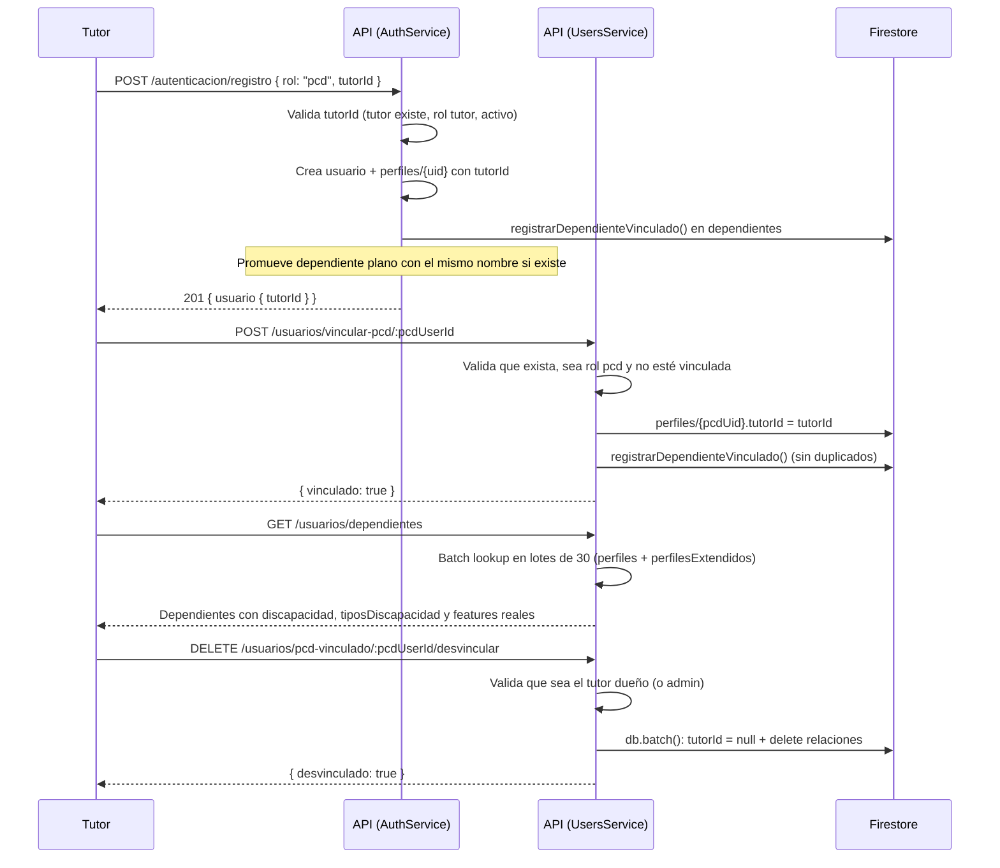

# 👨‍👩‍👧 Flujo Tutor ↔ PCD: Vinculación, Dependientes y Desvinculación

> **Para:** Isa (Backend Developer)
> **Autor:** Equipo Raíces
> **Fecha:** Agosto 2026
> **Objetivo:** Documentar el flujo completo de la relación **Tutor → Persona con Discapacidad (PCD)**: alta/vinculación de cuentas PCD, listado y enriquecimiento de dependientes, y desvinculación atómica.

---

## 📋 Índice

1. [Resumen Ejecutivo](#1-resumen-ejecutivo)
2. [Modelo de Datos en Firestore](#2-modelo-de-datos-en-firestore)
3. [Flujo Paso a Paso](#3-flujo-paso-a-paso)
4. [Reglas de Negocio y Validaciones](#4-reglas-de-negocio-y-validaciones)
5. [Endpoints Involucrados](#5-endpoints-involucrados)
6. [Estados de una Relación Tutor ↔ PCD](#6-estados-de-una-relación-tutor--pcd)
7. [Casos de Error](#7-casos-de-error)
8. [Pruebas](#8-pruebas)
9. [Preguntas Frecuentes](#9-preguntas-frecuentes)

---

## 1. Resumen Ejecutivo

**¿Qué hace este flujo?** Un **tutor** da de alta o vincula cuentas de **Personas con Discapacidad (PCD)** bajo su cuidado, las consulta en su lista de dependientes (con su discapacidad y funcionalidades reales) y puede **desvincularlas** de forma atómica.

**Reglas clave:**
- Una cuenta PCD **solo puede estar vinculada a un tutor a la vez** (`perfiles/{pcdUid}.tutorId`).
- La relación se registra en la colección `dependientes` (documento canónico con `id = pcdUserId`).
- **Sin duplicados:** si el tutor ya tenía un *dependiente plano* con el mismo nombre, se **promueve** ese documento (se le asignan `pcdUserId` y `esCuentaVinculada: true`) en lugar de crear uno nuevo.
- **Una sola fuente de verdad:** para cuentas vinculadas, los `features` y el perfil de discapacidad viven en los documentos reales de la PCD (`perfiles`, `perfilesExtendidos`) — el listado de dependientes los enriquece con un *batch lookup* en lotes de 30.
- **Desvinculación atómica** con `db.batch()`: limpia `tutorId` del perfil de la PCD y elimina las relaciones en `dependientes`.

---

## 2. Modelo de Datos en Firestore

### 📁 Colecciones involucradas

```
perfiles/{uid}                    ← Cuenta de usuario (PCD y Tutor)
├── rol: "pcd" | "tutor"
├── tutorId: <tutorUid> | null    ← ← Vínculo activo (solo en cuentas PCD)
├── nombreCompleto, email, activo
└── features: { ... }             ← Funcionalidades (fuente de verdad de la PCD)

perfilesExtendidos/{id}           ← Perfil de necesidades (profiling)
├── usuarioId: <pcdUid>
├── tiposDiscapacidad: string[] (o string JSON)
├── severidadDiscapacidad, etapaVida, ...
└── (modosComunicacion, necesidadesMovilidad, accesoTecnologia, ...)

dependientes/{id}                 ← Relación Tutor ↔ Persona bajo su cuidado
├── tutorId: <tutorUid>           ← Dueño de la relación
├── pcdUserId: <pcdUid> | null    ← null ⇒ dependiente plano (sin cuenta)
├── esCuentaVinculada: boolean    ← true ⇒ el id canónico es el pcdUserId
├── rol: "discapacitado" (plano) | "pcd" (vinculado)
├── nombreCompleto, parentesco
├── datosPerfil: string JSON      ← Solo para dependientes planos
└── fechaCreacion
```

> **Dependiente plano vs. vinculado:**
> - **Plano** (`esCuentaVinculada: false`, `pcdUserId: null`): no tiene cuenta de usuario; sus datos (tipos de discapacidad, edad, notas) viven en `datosPerfil` y sus `features` en el mismo documento.
> - **Vinculado** (`esCuentaVinculada: true`, `pcdUserId` presente): tiene cuenta real; sus `features`, discapacidad y necesidades viven en `perfiles/{pcdUid}` y `perfilesExtendidos`.

---

## 3. Flujo Paso a Paso



### Alta de PCD vinculada al registrarse (`auth.service.ts` → `register`)

1. **Validación previa de `tutorId`** (solo aplica a cuentas PCD):
   - Si `rol !== 'pcd'` y viene `tutorId` → `400`: *"Solo las cuentas con rol PCD pueden estar vinculadas a un tutor"*.
   - El tutor debe **existir**, tener `rol === 'tutor'` y `activo !== false` → si no: *"El tutor indicado no existe o no está activo"*.
2. El perfil se crea con `tutorId` y, tras el batch atómico, se llama a `registrarDependienteVinculado()` para registrar la relación en `dependientes`.

### Vinculación de una cuenta PCD existente (`users.service.ts` → `linkPcdToTutor`)

1. La PCD debe existir → si no: `404` *"Usuario PCD no encontrado"*.
2. Debe tener `rol === 'pcd'` → si no: `400` *"Solo se pueden vincular cuentas con rol PCD"*.
3. No debe tener `tutorId` previo → si lo tiene: `400` *"Esta cuenta PCD ya está vinculada a un tutor"*.
4. Se escribe `perfiles/{pcdUid}.tutorId = tutorId` y se registra la relación con `registrarDependienteVinculado()`.

### Registro de relación sin duplicados (`firestore-helpers.ts` → `registrarDependienteVinculado`)

Orden de resolución (devuelve `'ya_vinculado' | 'promovido' | 'creado'`):

1. **Idempotencia:** si ya existe el documento canónico `dependientes/{pcdUserId}` → solo se actualiza (`tutorId`, `esCuentaVinculada: true`, `rol: 'pcd'`, nombre).
2. **Promoción:** si el tutor tiene un dependiente **plano** con el mismo `nombreCompleto` → se promueve ese documento asignándole `pcdUserId` y `esCuentaVinculada: true` (evita duplicados).
3. **Nuevo registro canónico:** en caso contrario se crea `dependientes/{pcdUserId}` con `parentesco: null` y `datosPerfil: '{}'`.

### Listado enriquecido (`users.service.ts` → `getDependents`)

- Consulta `dependientes` por `tutorId`.
- Con los `pcdUserId` de las cuentas vinculadas hace **dos batch lookups en paralelo**:
  - `perfiles` por ID con `obtenerDocumentosPorIds` (lotes de 30).
  - `perfilesExtendidos` por `usuarioId` con `obtenerDocumentosPorCampo` (lotes de 30).
- Por cada vinculada asigna en memoria (O(1) vía `Map`): `features` reales (merge sobre `FEATURES_POR_DEFECTO`), `tiposDiscapacidad`, `discapacidad` (severidad) y `etapaVida`.

### Desvinculación atómica (`users.service.ts` → `unlinkPcdFromTutor`)

1. La PCD debe existir → `404`.
2. Debe estar vinculada (`tutorId` presente) → si no: `400` *"Esta cuenta PCD no está vinculada a ningún tutor"*.
3. **Autorización:** solo el tutor dueño o un admin (`actorRol !== 'admin' && tutorId !== actorId` → `403` *"Solo el tutor dueño puede desvincular esta cuenta"*).
4. **Batch atómico** (`db.batch()`):
   - `update perfiles/{pcdUid}` → `{ tutorId: null }`.
   - `delete` de **todas** las relaciones en `dependientes` donde coincidan `tutorId` y `pcdUserId` (incluye registros promovidos).

---

## 4. Reglas de Negocio y Validaciones

| Regla | Dónde | Comportamiento |
|-------|-------|----------------|
| Una PCD = un tutor | `register`, `linkPcdToTutor` | Rechaza vincular si la PCD ya tiene `tutorId` |
| El tutor debe ser válido | `register` | Debe existir, `rol: 'tutor'` y activo |
| Solo cuentas `rol: 'pcd'` se vinculan | `register`, `linkPcdToTutor` | `400` si el rol es otro |
| Sin duplicados en `dependientes` | `registrarDependienteVinculado` | Idempotente: actualiza canónico, promueve plano o crea |
| Solo el tutor dueño desvincula | `unlinkPcdFromTutor` | `403` para otros (admin exento) |
| Features de vinculadas → perfil real | `updateDependentFeatures`, `updateLinkedPcdFeatures` | Delegación a `perfiles/{pcdUid}.features` (una sola fuente de verdad) |
| El detalle de dependiente también enriquece | `getDependent` | Features + discapacidad + etapa de vida reales |

**Guards de los endpoints de vinculación** (`users.controller.ts`):
- `POST /vincular-pcd/:id` → `JwtAuthGuard` + `RolesGuard` con `@Roles('tutor')`.
- `DELETE /pcd-vinculado/:id/desvincular` → `JwtAuthGuard` + `RolesGuard` con `@Roles('tutor', 'admin')`.
- `PUT /dependientes/:id/features` y `PUT /pcd-vinculado/:id/features` → `@Roles('tutor')`.

---

## 5. Endpoints Involucrados

> Todos bajo `/api/usuarios` con `@ApiBearerAuth('jwt-auth')` salvo el registro.

| Método | Ruta | Rol | Descripción |
|--------|------|-----|-------------|
| `POST` | `/api/autenticacion/registro` | Público | Alta de PCD con `tutorId` (crea la relación en `dependientes`) |
| `GET` | `/api/usuarios/dependientes` | Autenticado | Lista de personas bajo cuidado (plenas + vinculadas enriquecidas) |
| `POST` | `/api/usuarios/dependientes` | Autenticado | Crear dependiente **plano** |
| `GET` | `/api/usuarios/dependientes/:id` | Autenticado | Detalle (enriquece si es cuenta vinculada) |
| `PUT` | `/api/usuarios/dependientes/:id` | Autenticado | Actualizar dependiente plano |
| `DELETE` | `/api/usuarios/dependientes/:id` | Autenticado | Eliminar dependiente (si es vinculada, limpia también `tutorId`) |
| `POST` | `/api/usuarios/vincular-pcd/:pcdUserId` | `tutor` | Vincular cuenta PCD existente |
| `PUT` | `/api/usuarios/dependientes/:id/features` | `tutor` | Features de dependiente plano |
| `PUT` | `/api/usuarios/pcd-vinculado/:pcdUserId/features` | `tutor` | Features de PCD vinculada (escribe en su perfil real) |
| `DELETE` | `/api/usuarios/pcd-vinculado/:pcdUserId/desvincular` | `tutor`, `admin` | **Desvincular de forma atómica** (batch: limpia `tutorId` + elimina relaciones) |

---

## 6. Estados de una Relación Tutor ↔ PCD

| Estado | `perfiles/{pcdUid}.tutorId` | `dependientes` | El tutor puede... |
|--------|:---------------------------:|:--------------:|-------------------|
| PCD sin vínculo | `null` | — (o plano sin `pcdUserId`) | Vincularla |
| **Vinculada** | `tutorId` | Registro canónico o promovido (`esCuentaVinculada: true`) | Ver sus datos reales, editar features, desvincular |
| **Desvinculada** | `null` | Registros eliminados | Volver a vincularla |

> **Nota:** al eliminar un dependiente vinculado (`DELETE /dependientes/:id`), también se limpia `tutorId` del perfil de la PCD para no dejar la relación a medias.

---

## 7. Casos de Error

| Escenario | Código | Mensaje |
|-----------|--------|---------|
| `tutorId` en cuenta que no es PCD | `400` | `Solo las cuentas con rol PCD pueden estar vinculadas a un tutor` |
| Tutor inexistente o inactivo | `400` | `El tutor indicado no existe o no está activo` |
| Vincular PCD inexistente | `404` | `Usuario PCD no encontrado` |
| Vincular cuenta que no es PCD | `400` | `Solo se pueden vincular cuentas con rol PCD` |
| PCD ya vinculada a otro tutor | `400` | `Esta cuenta PCD ya está vinculada a un tutor` |
| Desvincular PCD sin vínculo | `400` | `Esta cuenta PCD no está vinculada a ningún tutor` |
| Desvincular no siendo el tutor dueño | `403` | `Solo el tutor dueño puede desvincular esta cuenta` |
| Editar features de PCD ajena | `403` | `Esta PCD no está vinculada a tu cuenta como tutor` |
| Dependiente inexistente o de otro tutor | `404` | `Dependiente no encontrado` |

---

## 8. Pruebas

| Suite | Cobertura relevante |
|-------|---------------------|
| `users.service.spec.ts` | `getDependents` enriquece con discapacidad/features reales (batch lookups); `linkPcdToTutor` (éxito, PCD inexistente, rol no PCD, ya vinculada, promoción de plano); `unlinkPcdFromTutor` (batch atómico con `tutorId: null` + deletes, autorización tutor/admin, 403/404/400) |
| `auth.service.spec.ts` | `register` con `tutorId`: validación del tutor, alta de PCD vinculada y registro de la relación en `dependientes` |
| `firestore-helpers.spec.ts` | `obtenerDocumentosPorIds` (lotes de 30, mapa O(1)) y `registrarDependienteVinculado` (idempotencia, promoción, creación) |

---

## 9. Preguntas Frecuentes

**¿Qué diferencia hay entre un dependiente plano y una cuenta vinculada?**
El plano no tiene cuenta de usuario (sus datos viven en `datosPerfil` y `features` locales). La vinculada tiene cuenta real (`rol: 'pcd'`) y sus `features`/discapacidad viven en sus propios documentos, que el tutor ve enriquecidos.

**¿Puede una PCD tener dos tutores?**
No. `perfiles/{pcdUid}.tutorId` admite un solo valor; vincular una PCD ya vinculada devuelve `400`.

**¿Qué pasa si el tutor ya tenía un dependiente plano con el mismo nombre y vincula la cuenta?**
Se **promueve** ese documento (no se crea duplicado): se le asignan `pcdUserId` y `esCuentaVinculada: true`.

**¿La desvinculación es atómica?**
Sí. `unlinkPcdFromTutor` usa `db.batch()`: limpia `tutorId` del perfil y elimina todas las relaciones de `dependientes` en una sola operación.

**¿Quién puede desvincular?**
Solo el tutor dueño o un administrador (`@Roles('tutor', 'admin')` + verificación del `tutorId`).

**¿Dónde vive la lógica?**
- `auth.service.ts` (`register`) — alta de PCD vinculada.
- `users.service.ts` (`linkPcdToTutor`, `unlinkPcdFromTutor`, `getDependents`, `getDependent`, features) — operaciones sobre la relación.
- `common/utils/firestore-helpers.ts` (`registrarDependienteVinculado`, `obtenerDocumentosPorIds`, `obtenerDocumentosPorCampo`) — helpers reutilizables.

---

## 🔗 Archivos de referencia

- `src/modules/auth/auth.service.ts` — registro de PCD con `tutorId`
- `src/modules/users/users.service.ts` — vinculación, listado enriquecido, features y desvinculación
- `src/modules/users/users.controller.ts` — endpoints `/vincular-pcd`, `/pcd-vinculado/:id/desvincular`, `/dependientes`
- `src/common/utils/firestore-helpers.ts` — `registrarDependienteVinculado` y batch lookups en lotes de 30
- `src/database/firestore.constants.ts` — nombres de colecciones (`perfiles`, `perfilesExtendidos`, `dependientes`)
